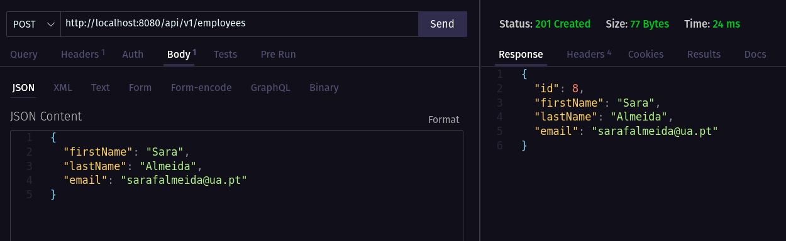
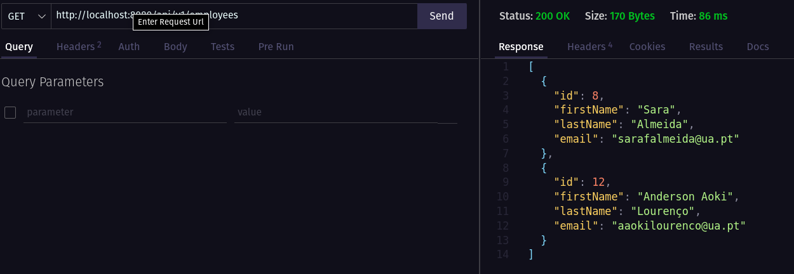
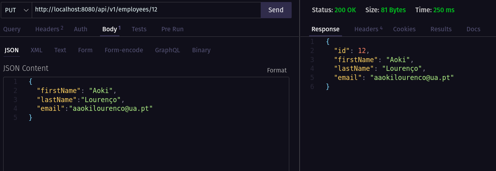
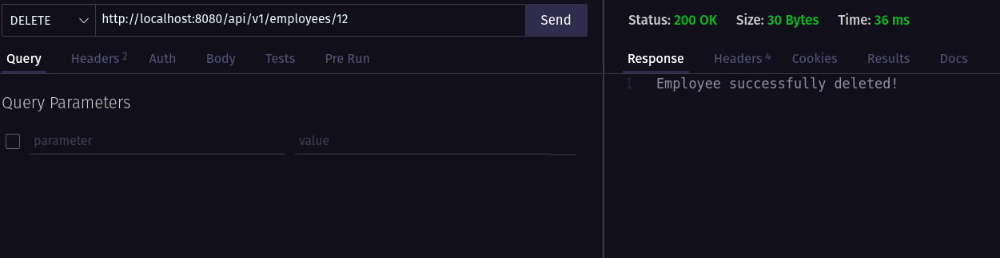
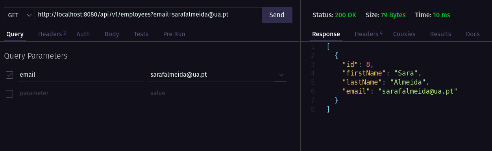

# lab3

## lab3_1

### alínea (b)
Segui os exercícios do tutorial, bem como analisei o código do GitHub de forma a completar o objetivo de criar uma **aplicação CRUD** com Spring Boot e Thymeleaf. É possível ver o resultado final acedendo a localhost:8080 no browser.

* *foi necessário mudar o nome da clase User para MyUser*.

### alínea (c)

* A classe “UserController” recebe uma instância de “userRepository” através do construtor e este novo user repository é instanciado devido à anotação **@Autowired**.

* Os métodos invocados no objeto "userRepository" pela classe "UserController" são *save()*, *findAll()*, *findById()* e *delete()*.
Estes métodos são definidos pela classe **CrudRepository** à qual a classe "UserRepository" faz *extends*.

* Os dados estão a ser guardados numa base de dados **h2**, definida no ficheiro *pom.xml*. Esta base de dados é uma *base de dados em memória*, ou seja, quando o servidor é desligado, os dados são perdidos.

* A regra do "not empty" endereço de email está definida na classe *MyUser* através da anotação **@NotBlank**.

### alínea (d)

* Foi necessários alterar a classe MyUser adicionando a variável Phone no construtor, adicionando numa anotação @NotBlank e criar os respetivos métodos get e set.
* Adicionar também um campo para o phone no ficheiro add-user.html.

* A anotação **@NotBlank** é usada para marcar um campo como uma *sequência de caracteres não nulos*, ou seja, que deve conter pelo menos um caracter que não seja um espaço em branco.

## lab3_2
### alínea (a)
Comecei por iniciar a base de dados dentro de um container docker como indicado no guião, correndo o seguinte comando:

```bash
$ sudo docker run --name mysql5 -e MYSQL_ROOT_PASSWORD=secret1 -e MYSQL_DATABASE=demo -e MYSQL_USER=demo -e MYSQL_PASSWORD=secret2 -p 33060:3306 -d mysql/mysql-server:5.7
```
* O container terá o nome mysql5, a password do root é secret1, o nome da base de dados é demo, o nome do utilizador é demo e a password é secret2. O container está a correr na porta 33060.

### alínea (b) -> (f)
* Segui as indicações do guião tomando ao mesmo tempo por base o tutorial indicado.

* O ficheiro *application.properties* utilizado foi o apresentado no guião.

### alínea (g)
* Para testar a aplicação, é necessário iniciar o container com *docker start mysql* e correr a aplicação.

* Para testar os métodos da REST API, utilizei a extensão do VS Code *Thunder Client*:

    -Exemplo de Insert:
        
    
    -Exemplo de Get:
        

    -Exemplo de Update:
        
    
    -Exemplo de Delete:
        

    -Exemplo de Get com emal:
        

## lab3_3
### alínea (a) -> (c)
Neste exercício tomei por base tudo o que foi feito no anterior, no entanto, com algumas alterações coerentes com o problema: como termos dois campos, neste caso, Movie e Quote que requerem cada um um repository, um service, etc.

-Quanto ao controler, em relação ao exercício anterior, alterei os endpoints para retornarem os dados pretendidos, que estão neste caso relacionados com o exercício semelhante do guião anterior e incluem mátodos como por exemplo *getQuotesByMovie()* ou *getMovieById()*

### alínea (d)
* Foram adicionados os ficheiros *Dockerfile*, *.env* e *compose.yml*. Ao correr o comando *docker-compose up* é possível verificar que os containers estão a correr e que a aplicação está a funcionar corretamente.

